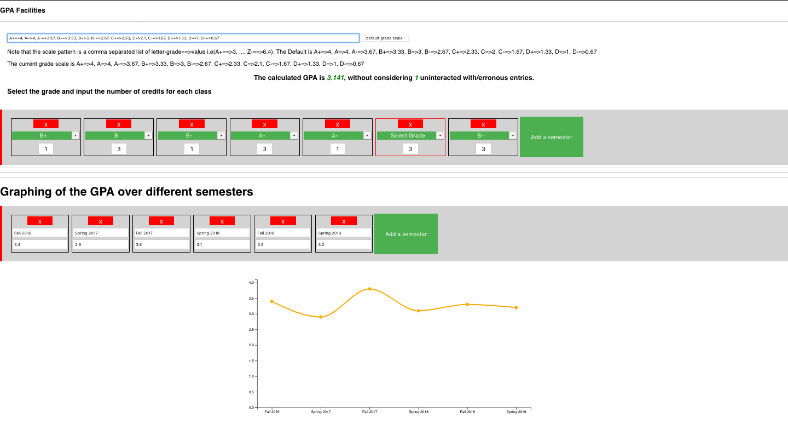

---
The tool consist of 2 main input.
The first 4 box are for calculating the GPA. Each box correspond to a course. The other input area is for graphing the change in GPA over the semester. The first input is for semester name and the second is the cummulative GPA obtained in that semester. 
___
TODO:
Transitions in the graph update
